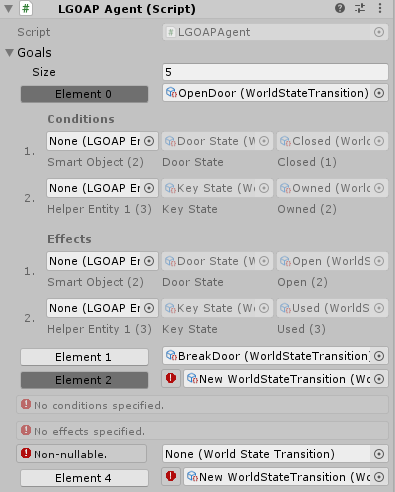

# Ro-L-GOAP

>Dependencies: [SO-ReoderableList](https://github.com/herohiralal/ScriptableObject-ReorderableList) and [Essential Boilerplate](https://github.com/herohiralal/Essential-Boilerplate).

### What?

Check [this](https://twitter.com/aigamedev/status/774190580410814464) out for a better understanding of what LGOAP is.

In essence it's an AI model based on GOAP but turns the actions into a hierarchy to optimize the state-space search.

### Is it ready to use?

No but it's quite close.

## Current progress

> I've created a generic model of the world that can be extended to any game. It also cleverly manages to avoid any kind of cartesian explosions related with creating variables for different entities.

>Create keys, that will represent the game world in terms the planner can understand. The database is not a singleton, so as an optimization you're free to create different worldspaces for different types of AI agents.

>These keys can have values assigned to them, which will be carried out by sensors that the user will write themselves.
>Note that the values are supposed to be used as enumerations and not as raw floating point values that represent the exact enemy health.
>However, you're still free to create upto 255 values within a single enumeration, which should give you the precision, if needed.

>In turn, these key-value pairs are used by transitions.

>Transitions define the change in key-value pairs, specific to involved entities. These will in turn be used by Goals & Actions for the actual planning. Entities like LGOAP Objects & LGOAP Agents will reference them.
>The entities range from 0 to 5 currently (AI Agent, Global, SmartObject, and 3 other helper entities, which is easily extendable upto indefinitely).

>This is an LGOAP Agent. It uses a custom UI to define the involved entities.

## To-do:

>1. Create an interface that defines an action, with methods OnActionStart, OnActionOngoing, and OnActionEnd.
>
>2. ~~But more importantly, create a system that picks up any class that extends the said interface and presents all of them as an enumeration that you can choose from from within the editor.
>(I already have a plan on how to do this.)~~
>*DONE!* - SerializedInstance system included within an updated version of Essential Boilerplate can do exactly this.
>
>3. Create the Action class (preferably a struct) that can be created at runtime by LGOAPObject which then is passed on to any Agent's actions list. This is in addition to certain actions that an Agent might have to begin with.
>
>4. Write the actual planner that performs a state-space search. This part is easy, it's just boilerplate already provided within the research paper.
>
>5. Implement the same functionality within Unity's Jobs System for a performance boost like its AI planner currently does.

# Created by Rohan.

>## Additional Credits for the Original Research on LGOAP:
>
>#### Giuseppe Maggiore (NHTV University of Applied Sciences)
>#### Carlos Santos (NHTV University of Applied Sciences)
>#### Dino Dini (NHTV University of Applied Sciences)
>#### Frank Peters (NHTV University of Applied Sciences)
>#### Hans Bouwknegt (NHTV University of Applied Sciences)
>#### Peter Spronck (University of Tilburg)

### Thanks.